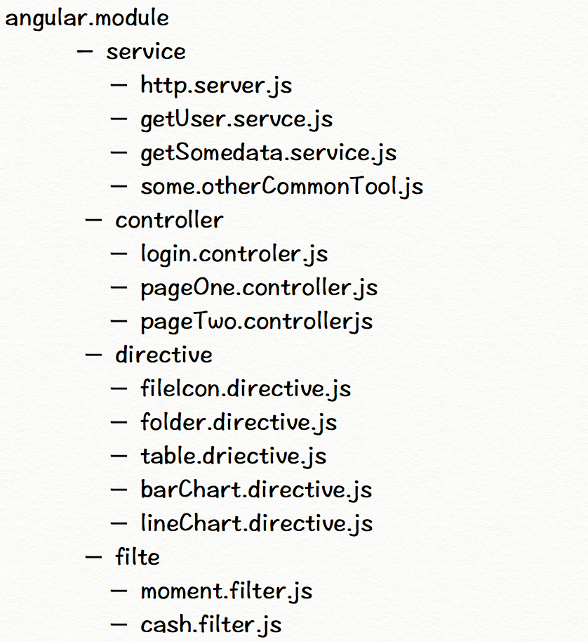
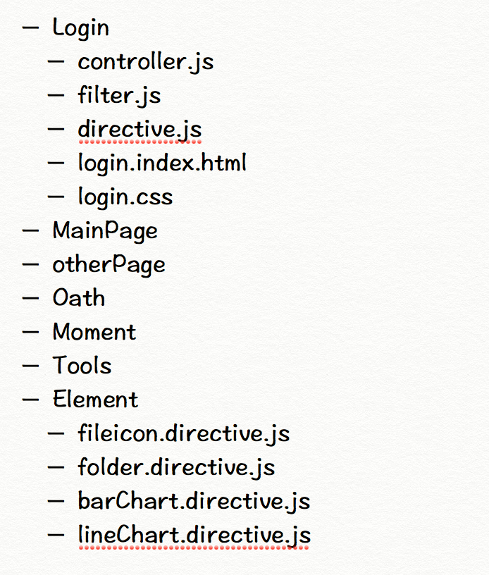

# 从实现角度谈如何使用 Angular 

 > 我对 Angular API 也没每个都记的很牢靠，也要查文档，本文只给出 使用 angular 的思路和 它一些关键feature做的事情，以便在任何情况，你都能handle 

1. 概览
 a. 如果只从功能角度来看， Angular 是个模版引擎
 b. 从框架角度来看，   玩的就是代码组织结构，高内聚，低耦合（玩代码组织结构，其实跟人事管理也没啥区别）
 

2. Angular 应用的代码组织结构
	对于大项目来说：
	* 过去：
		* 整个项目就是 一个 大 module
		
	* 现在：
		* 一个逻辑模块 或 一个通用组件 作为 一个 module
		
	* 对于小项目来说：
		* 可以只有一个文件，如果你实在够懒甚至可以只写一个directive, 跟用 jQuery 无差.
	
		```
		angular.module(‘myApp’,[‘A’,’B’,’C’],function(){})
			.controller(‘id’,fn) 
	 		.directve().filter()
	 	```

3. scope 是核心

 scope ,是将 angular 所有概念串联起来的主线，理解了它，angular就基本掌握了80%

	```
	  module
		  controler
			  $scope.goFn = function(){}
			  
	  <div scope=“your.name.space.x”>
		 <you my-clice='goFn()'></you>
	  </div>
	```

4. directive
	* link(scope, element, attrs)
		* 内建了jQlite ( 阉割版的jQuery, angular size 很 big 的原因之一 ), 
		如何 让 element 元素 直接变成 一个 jQuery 对象?
		
	* 最最最关键
		* scope.apply()

5. Angular 启动方式
 * 自动 
	```html
	<html ng-app> 
	```
  * 手动 
	   ```
		angular.module(‘A',[]);
		document.ready
			angular.bootstrap(document,[‘A']);
		```
    

6. 关键概念理解
	 * service 是个单例
		 $http, $state(大量内建 service)
     * directive
		  ng-click, ng-view, scope, ng-classs (大量内建 directive)

	> FB的react.js 攻击angular的一个主要入口，就是scope.apply 时，为实现界面最小化刷新做了脏数据的检查工作，被认为是自作聪明。后续的版本中提供了控制接口，可以人为干预。

7. Angular 生态圈

	  	angular 生态圈： http://ngmodules.org/
	   	如果是新手，又不想花太多时间系统学习angular,只想快速使用和上手，
	   	建议去 http://yeoman.io/ 上搜下各类 angular的脚手架，去官网摘下api 基本可以10分钟内，无痛上手。
       
8. e2e 测试demo 演示

	之前给testjs team 发过的一个pull request, 顺便撸了个e2e测试过程
    http://v.youku.com/v_show/id_XODA2MzMzNDk2.html

	* 基础概念扫清: sellenim test ，持续集成.
	* javascript 版的sellenim : webdriverjs (如何使用?请看博客,写的比较  粗糙http://besideriver.com/#/post/blog/2013/12/07/sellenim-webdriverjs.html)
* 与单元测试框架集成  ， 视频中使用的是TJ的 mocha(界面较友好)

9. 其实很多人在黑angular, Google 自己也没有一个项目用Angular

	比如这位 
	“daniel.steigerwald.cz and I’m Google Developer Expert”
	文章: https://medium.com/este-js-framework/what-i-would-recommend-instead-of-angular-js-62b057d8a9e
	或 https://medium.com/este-js-framework/whats-wrong-with-angular-js-97b0a787f903
	
 		
 

